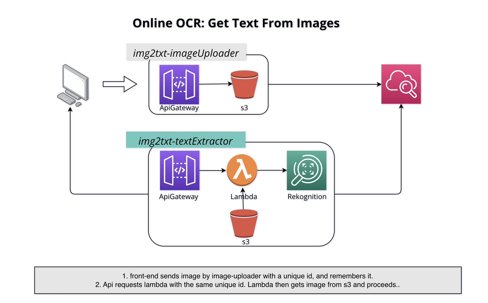

# image-2-text

 Extract text from image using AWS Rekognition

* CI CD pipeline      - `done`
* Lambda POC          - `done`
* return all texts    - `done`
* handle no text case - `done`
* test script in ci   - `done`
* get image from s3   - 
* apigw integration   -

Find current version of a python library - `pip3 freeze | grep lib_name`

##### Ⓒ Ashraf Minhaj
##### Find me on LinkedIn [Ashraf-Minhaj](https://www.linkedin.com/in/ashraf-minhaj/)

#### Learn By Making.Get your hands dirty to become a craftsman